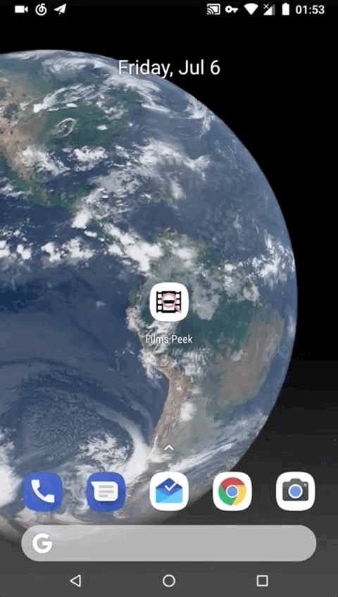
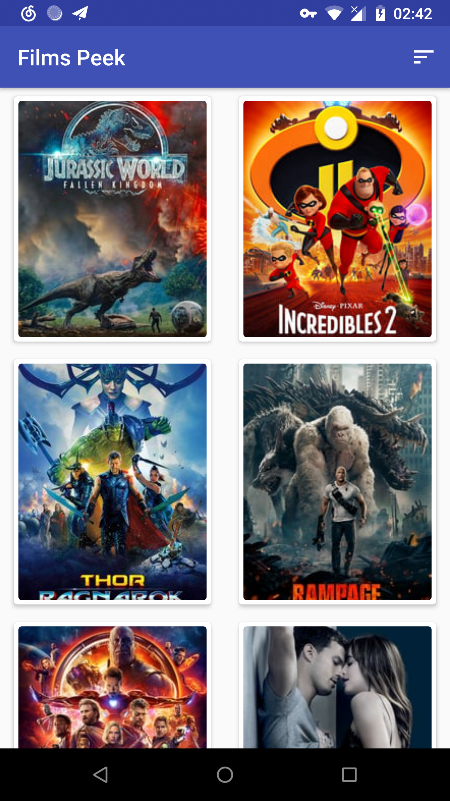
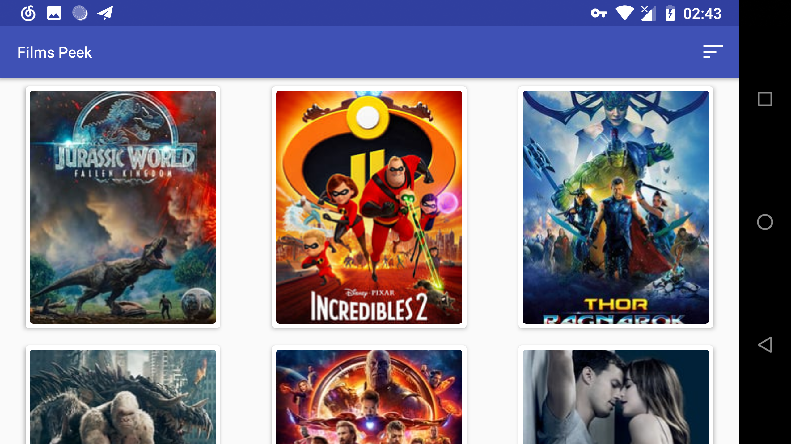
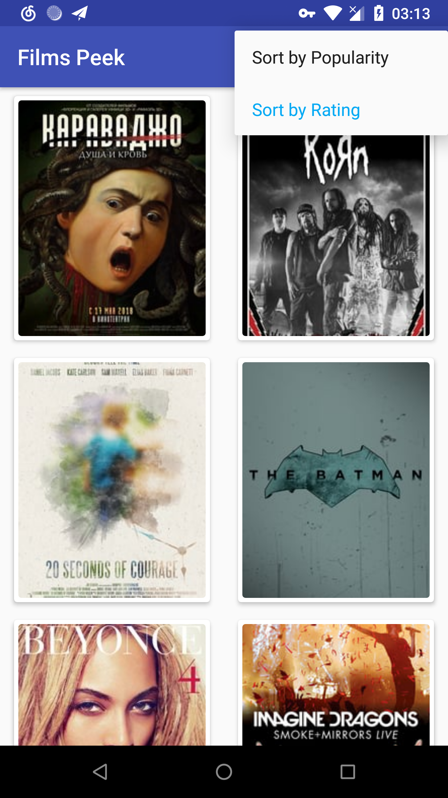
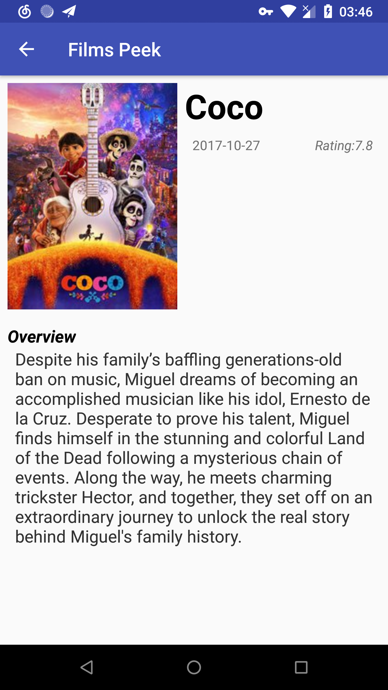

# Films Peek

An Android App that list some films.

**IMPORTANT:** Enter your the Movie Database (TMDb) API key in `NetworkUtils.java`. Mind the global variable named `api_key`.

**07/06/18: Stage One Completed.**

First of the first, the App has a splash/launch screen with a one second animation of the App logo at the upper part of the screen and THE MOVIE DB logo at the lower middle part, as TMDb API requested.

Note: This product uses the TMDb API but is not endorsed or certified by TMDb.

The animation is implemented in a dedicated Activity with an `AnimationSet` object which contains two animations, one is the `TranslateAnimation` object that makes linear motion, the other is the custom `SemicircleAnimation` object that makes semicircle motion horizontally and clockwise.

 

The main screen of the App is a GridLayout RecyclerView list of films posters in CardView. The columns of the list are auto fit in the screen and the column number is calculated in `DisplayUtils` class by dividing the screen width by the list item width in pixel.

The RecyclerView list has sort of "endless scrolling" feature, implemented the pagination in some way. The problem here is that, if users rotate their device when there are over one page of data loaded, then the App only save the last page of data and lost all the previous data. I don't know the solution yet, hope this could be fixed later on.

The RecyclerView list has the custom item animation defined in `/res/anim/` directory and set using a `LayoutAnimationController` object. 

The App fetch data from TMDb API using OkHttp library in a custom `AsyncTaskLoader`. And the image displaying work is done using Glide  Generated API.

The ranking of the list can be changed in the AppBar's menu and there are two options: popularity and rating. By default, the app will display the list sorted by popularity; once users selected any other one, the text color of the selected option will turn into `ColorAccent` and refresh the list with a rearranged one.

All the necessary data of the setting will be stored in `SharedPreferences` in `SortPreferences` class, so the App get the user preference for the list sorting and take advantage of it, even when the app was closed or the device restarted.

In the main screen, the App use `SwipefRefreshLayout` as the loading indicator. It will be triggered when the app first launch and the sort option is changed. On the other hand, users can swipe down to refresh the list at any time.

When the device is not connected to the Internet or the App failed to query data from the API, their corresponding error messages will be displayed on the screen.

When users click one of the poster in the list, the App takes the user to the detail screen, which display the title, release date, average vote, overview and poster of the film.

All the data mentioned above are in the `Film` class, and when MainActivity intents to DetailActivity, the app use Parceler library to wrap the `Film` object into a `Parselable` and put it in the intent's extra.

This is a training project in [Udacity's Android Nanodegree program](https://cn.udacity.com/course/android-developer-nanodegree--nd801-cn-advanced).  
Check out other courses here: https://www.udacity.com/courses/all